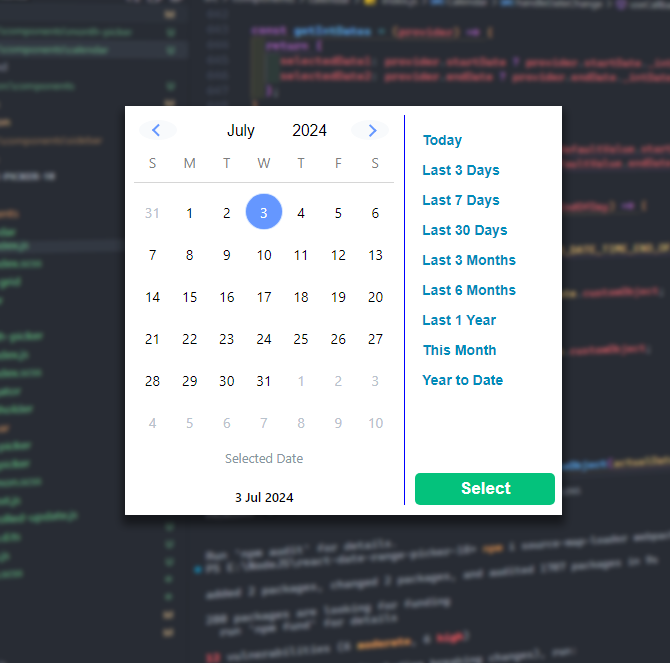

<div align="center">
	<br>
		
	</a>
	<br>
</div>

<p align='center'>
  <a href="https://www.npmjs.com/package/react-date-range-picker-18">
  </a>
  <p align='center'>⚛️📆 React Js based date/range picker, unlike other range pickers it uses single calendar to select the range. </p>
  <p align='center'>Compatible with React 18💓 </p>

## 🙇 Original Creator

#### Aadil Hasan
- Github: [aadilhasan](https://github.com/aadilhasan)
- [Source Available at](https://github.com/aadilhasan/react-range-picker)
</p>
    <br />
    <br />
</sup>

</p>
    <br />
    <br />
</sup>

## 🙇 Updated By 

#### ItDebojit
- Github: [hakrNJN](https://github.com/hakrnjn)


## Installation

```bash
$ npm i daterange-picker
```


## Usage

```javascript
import RangePicker from 'daterange-picker'

<RangePicker
          onDateSelected={onDateSelect}
          defaultValue={{
            startDate: new Date(),
            endDate: ''
          }}
          onClose={onClose}
          // onOpen={() => console.log(' openend')}
          dateFormat="dd-MM-YYYY"
          // disableRange
          // rangeTillEndOfDay
          // selectTime
        />
```